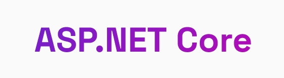
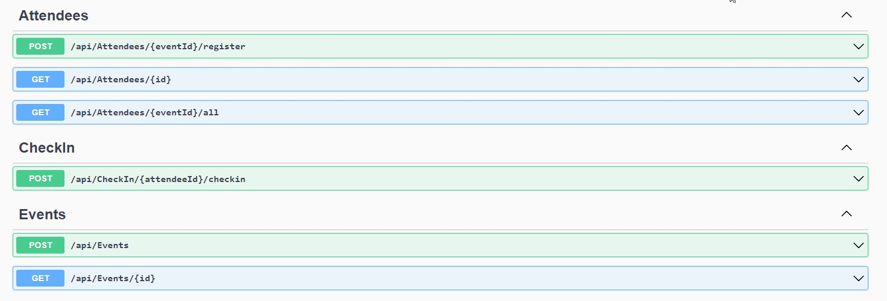

# Pass.In - Backend C# feito com ASP.NET e SQLite



## Introdução
Pass.In é uma aplicação para gestão de participantes em eventos. 
Organizadores disponibilizam eventos e os participantes podem se cadastrar neles e fazer check-in no dia do evento. 

## Requisitos do projeto
### Funcionais
**Organizador**
1. O organizador pode cadastrar um evento
2. O organizador pode receber dados de um evento já cadastrado
3. O organizador pode ver todos os participantes cadastrados em um evento
4. O organizador pode pesquisar especificamente por um participante

**Participante**
1. O participante pode se cadastrar em um evento
2. O participante pode receber dados de uma inscrição sua em um evento
3. O participante pode fazer check-in no evento

## Regras de Negócio
1. O participante pode se cadastrar apenas uma vez em um evento (chave principal é o e-mail de cadastro)
2. O participante pode fazer check-in apenas uma vez em um evento
3. O participante só pode se cadastrar em eventos que ainda tem vagas disponíveis

## Tecnologias utilizadas
* C#
* ASP.NET
* MVC
* SQLite (local)
* Swagger

## Instruções de instalação
1. Instalar o .Net Core 8: https://dotnet.microsoft.com/pt-br/download
2. Clonar o repositório
3. Ir até a pasta PassIn.API dentro do repositório em uma interface de linha de comando 
4. Rodar o comando `dotnet run Program.cs`
5. Abrir o link fornecido pela aplicação dentro da interface
6. Brincar no Swagger

## Guia do Usuário
### Endpoints

### Modo de usar

A aplicação gira em torno do conceito do evento. Então para se ter qualquer resposta com o programa, a primeira coisa a se fazer é cadastrar um evento usando o endpoint **/api/Events**. O próximo passo será cadastrar um novo participante no evento a partir de **api/Attendees/{eventId}/register**, com ```eventID``` sendo o Id retornado pelo método ```POST``` anterior. 
A partir daí existe uma estrutura básica para adicionar mais eventos, adicionar mais participantes em eventos, realizar check-ins, e obter todas essas informações registradas via requisições ```GET```.

Evidentemente o uso mais interessante da aplicação é implementar uma solução de front-end por cima para que ela possa rodar para usuários finais graciosamente. 

## Suporte
Você pode me contatar em danielcmittelman@gmail.com

## Autores e reconhecimento
Implementado por [Daniel Couto Mittelman](https://www.linkedin.com/in/daniel-couto-mittelman-34b544116/)

Esse projeto foi realizado durante a NLWUnite 15, um evento de estímulo ao aprendizado em desenvovimento de software da Rocketseat. Fica o agradecimento à equipe por ter disponibilizado a estrutura, o sem tempo e seus conhecimentos de forma gratuita para o benefício de todos os participantes.

Professor responsável pelo tutorial:\
Welisson Arley
